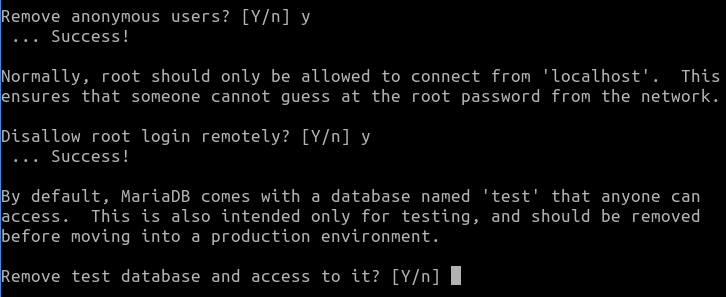

# Tarea 06 · Despliegue de Aplicaciones Web
___
## Oliver Fabian Stetcu Stepanov
___
## Tarea LAMP 
___

## 1. Objetivo de la práctica

El objetivo principal de esta práctica es que aprendamos a desplegar una aplicación web
estándar sobre un entorno o stack LAMP. Ya sabemos cómo instalar Apache Web Server, por lo
que tendremos que agregar un servidor de bases de datos (MySQL/MariaDB) y el intérprete de
PHP. Al final de la práctica tendremos un servidor web Apache con un CMS Wordpress
instalado y funcionando.

## 1.1. Qué necesitamos para instalar Wordpress.
Antes de realizar el despliegue de una aplicación web, debemos tener claros los requisitos de
la misma, tanto de servicios como versiones, usuarios, permisos, etc.

En el caso de Wordpress podemos echar un vistazo en su web oficial. Como vemos, los requisitos más importantes que debemos cumplir son:

> PHP 7.4 o superior y MySQL 5.7 o superior / MariaDB 10.3 o superior.

## 2. Instalación de los componentes necesarios.

Una vez que estamos dentro de nuestro servidor, es buena idea actualizar los repositorios
antes de empezar con las instalaciones. Para ello haremos un update y un upgrade de nuestro
sistema:

```bash
sudo apt update
sudo apt upgrade
```

Resultado:


## 2.1. Instalación de Apache Web Server

Si ya tienes una máquina con Apache instalado, puedes saltarte este paso. Ya lo tengo instalado:

```bash
sudo systemctl status apache2
```

Resultado:


## 2.2. Instalación de PHP

Vamos a instalar PHP desde nuestro terminal, con el comando siguiente. Si queremos instalar las librerías más habituales, podemos usar el comando:

```bash
sudo apt install php
sudo apt install php-common
```

Resultado:


NOTA; Si queremos instalar todas las librerías que haya disponibles para Php en nuestro
repositorio. Si queremos comprobar la versión de Php que tenemos instalada usamos el comando:

```bash
sudo apt install php-*

php --version

o

php -v
```

Resultado:


## 2.3. Instalación de MariaDB Server.

Para instalar MariaDB server debemos seguir los siguientes pasos:

**Paso 1. Instalar mariadb-server:**

Para arrancar/parar/reiniciar/ver estado del servicio utilizaremos los siguientes comandos:

```bash
sudo apt install mariadb-server
sudo systemctl restart mysqld
sudo systemctl status mysqld
```

Resultado:


## Paso 2. Establecer la seguridad del servidor de bases de datos:

```bash
sudo mysql_secure_installation
```

Resultado:


Si queremos crear una nueva contraseña (o si es la primera vez que lo ejecutamos) damos a
intro y continuamos.


Cuando nos pregunte si deseamos cambiar la contraseña de root, le contestamos ‘y’, e
introducimos la nueva contraseña (recuerda que debe cumplir las directrices de seguridad:
longitud, mayúsculas, minúsculas, números y caracteres especiales):




Eliminamos la posibilidad de usar usuarios anónimos y de conectarse de forma remota, y
borramos las bases de datos de prueba. Le confirmamos que recargue la tabla de privilegios.


Ya tenemos instalado todo lo necesario para instalar cualquier aplicación basada en PHP +
MySQL.

## 3. Instalación de Wordpress

Para instalar Wordpress, como para la mayoría de aplicaciones web, necesitaremos seguir los
siguientes pasos:

- Crear un directorio en Apache donde pondremos los ficheros de instalación, asociado a
un ‘virtualhost’ que gestionará las peticiones a nuestra aplicación.

- Crear un usuario y una base de datos para que la aplicación pueda desplegar todas las
tablas necesarias durante el proceso de despliegue.

## 3.1. Creación del virtualhost para nuestro sitio web

Vamos a crear un espacio para nuestro gestor de contenidos o sitio web y crearemos un
virtualhost en Apache para gestionarlo. Suponemos que vamos a trabajar con un dominio
ficticio **stetcu-wp.com**.

Creamos nuestro sitio en el directorio de configuración de Apache:

```bash
sudo nano /etc/apache2/sites-available/stetcu-wp.com.conf
```

El contenido del fichero será:


Guardamos y salimos.

Si activamos ahora el sitio, puede que nos devuelva un error, ya que aún no existe la carpeta
wordpress. Podemos hacer la activación una vez que hayamos descomprimido los ficheros de
instalación de wordpress.

## 3.2. Descarga y despliegue de los ficheros de instalación.

Para descargar wordpress en nuestro servidor vamos a utilizar **wget**, por lo que debemos saber
la url de descarga del paquete de Wordpress para poder usar esta utilidad.

Si nos fijamos en el botón de descarga de la página de Wordpress y seleccionamos con el
botón derecho del ratón la opción ‘copiar dirección de enlace’, obtendremos la url de
descarga: https://es.wordpress.org/latest-es_ES.zip

Descargamos los ficheros de wordpress. Con la opción -P nos creará la carpeta.

```bash
sudo wget https://es.wordpress.org/latest-es_ES.zip -P /var/www
```

Resultado:


Descomprimimos el paquete descargado usando la herramienta unzip. Usamos la opción -d
para indicar la carpeta destino:

```bash
sudo apt install zip
sudo unzip /var/www/latest-es_ES.zip -d /var/www
```

Resultado:


Te creará una carpeta llamada **wordpress** que cambiaremos su nombre nuestra carpeta
pública **stetcu.com**:

```bash
sudo mv /var/www/wordpress /var/www/stetcu-wp.com
```

Resultado:


Para que Apache tenga el control de las carpetas durante la instalación, hay que hacerlo
propietario de todas las carpetas de Wordpress:

```bash
sudo chown -R www-data:www-data /var/www/stetcu-wp.com
```

Resultado:


## 3.3. Creación de la base de datos y el usuario para la instalación

Vamos a crear una base de datos llamada ‘wordpress’ y un usuario llamado ‘wordpress’ en
MariaDB. Accedemos a la consola de MariaDB:

```bash
mysql -u root -p
```

Resultado:


## 3.4. Activación del sitio web.

Una vez que tenemos todos los ficheros en sus carpetas y hemos creado la base de datos para
la instalación de Wordpress, vamos a activar el sitio web. Para ello utilizaremos el comando
a2ensite de Apache:

```bash
sudo a2ensite stetcu-wp.com.conf
sudo systemctl reload apache2
```

Resultado:


Modifico el /etc/hosts:

```bash
sudo nano /etc/hosts
```

Resultado:


## 3.5. Desplegando la aplicación desde el navegador

Hacemos clic en ‘Vamos a ello!’ para iniciar el proceso, rellenando los datos que nos pide:

```bash
sudo apt install php libapache2-mod-php php-mysql
sudo systemctl restart apache2
```


Si todo ha ido bien, al teclear nuestro dominio en el navegador, nos aparecerá la pantalla de
bienvenida del instalador de Wordpress:


Hacemos clic en ‘Vamos a ello!’ para iniciar el proceso, rellenando los datos que nos pide:


Si ha conseguido conectar con la base de datos y no ha habido ninguna incidencia, nos
mostrará un mensaje de confirmación para iniciar la instalación:


Ahora nos solicitará información de personalización de nuestro sitio web y la creación de un
usuario administrador del CMS:


Una vez hecho esto, le damos a ‘Instalar Wordpress’ y el proceso se realizará de forma
automática. Al finalizar nos mostrará un mensaje de confirmación:


Ya podemos entrar en el panel del CMS pulsando en el botón ‘Acceder’.


## Oliver Fabián Stetcu Stepanov | 2º DAW
